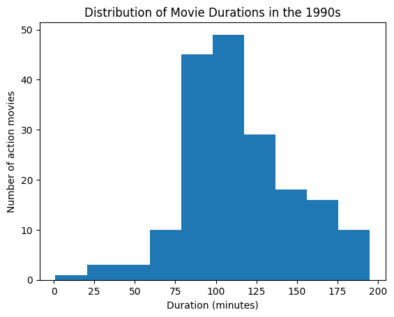

# Investigating Netflix Movies 🎬

 

## 📌 Project Overview
This project explores Netflix movies to uncover patterns in movie durations and genres, focusing on releases from the 1990s.  
You can view a polished version of the analysis with rewritten code and visualisations here: [Notion write-up](https://clean-hat-00e.notion.site/Investigating-Netflix-Movies-271d5d617ff780e6a387ca5da147cd24?source=copy_link)

 

## 🔍 Key Insights
- Most frequent movie duration in the 1990s ≈ **100 minutes**  
- Number of short action movies (< 90 min) in the 1990s = **7**  

 

## 🚀 Tools Used
- Python (pandas, numpy, matplotlib)
- Jupyter Notebook

 

## 📖 References
- Dataset: Provided by [DataCamp](https://www.datacamp.com/) for educational purposes.
